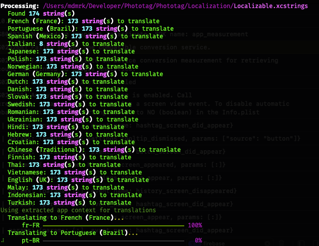

# 🌎 LocalizerX

> **Quick Tip:** You can use `lrx` as a handy shorthand for the `localizerx` command anywhere!

Welcome to **LocalizerX**! The CLI tool designed to make your localization workflow seamless and fast. LocalizerX uses the power of the Gemini API to automatically translate your project assets across multiple platforms and formats.



## Why LocalizerX?

LocalizerX is built for developers who want to reach a global audience without the headache of manual translations. Whether you're building a macOS app, a Chrome extension, or a web project, we've got you covered!

### ✨ Key Features

- **🤖 AI Agent Ready:** Comes with a standard Agent Skill (`use-localizerx`) for Claude Code and Gemini CLI—let your AI agents translate your project autonomously!
- **📦 Multi-Format Support:** Translate `.xcstrings`, fastlane metadata, Chrome Extensions, frontend JSONs, and Android `strings.xml`.
- **🚀 ASO-Optimized:** Generate and translate App Store screenshot texts with marketing-focused prompts designed to boost your store presence.
- **🛡️ Safe & Smart:** Automatically preserves placeholders (`%@`, `{name}`, etc.) and respects developer comments for context.
- **⚡ Fast & Efficient:** Uses SQLite caching to avoid redundant API calls and save you money.
- **🛠️ Flexible:** Supports pluralization, declension forms, and character limit enforcement.

---

## 🚀 Installation

### Requirements

- **macOS** (for the best experience)
- **Python 3.10+**
- **Gemini API key**

### 1. Using pipx (Recommended for Global Usage)
`pipx` installs LocalizerX in an isolated environment and makes the `localizerx` and `lrx` commands available globally.

```bash
# If you don't have pipx yet:
brew install pipx
pipx ensurepath

# Install LocalizerX
pipx install localizerx
```

*Note: If the package is not yet on PyPI, you can install directly from the source.*

### 2. From Source
If you want to use the latest version or contribute to the project:

```bash
# Clone the repository
git clone https://github.com/khodulov-m/LocalizerX.git
cd LocalizerX

# Install globally using pipx
pipx install .

# OR for development (changes apply immediately)
pip install -e ".[dev]"
```

---

## ⚙️ Setup

### 1. Your API Key

Grab your Gemini API key from the [Google AI Studio](https://aistudio.google.com/) and set it as an environment variable:

```bash
export GEMINI_API_KEY="your-api-key"
```

To keep it permanent, add it to your `~/.zshrc` or `~/.bashrc`:

```bash
echo 'export GEMINI_API_KEY="your-api-key"' >> ~/.zshrc
```

### 2. Initialize Your Config

Create a configuration file to set your default languages and preferences:

```bash
lrx init
```

This creates a config file at `~/.config/localizerx/config.toml`. Here is a peek at what you can customize:

```toml
source_language = "en"
default_targets = ["ru", "fr-FR", "pt-BR", "es-MX", "ja", "de-DE", "zh-Hans"]

[translator]
model = "gemini-3-flash-preview"
temperature = 1.0
batch_size = 180
use_app_context = true # Helps AI understand your app's context for better translations!

# Command-specific overrides
[metadata]
model = "gemini-2.5-pro"
batch_size = 50
```


---

## 📖 How to Use

### 🏎️ Quick Translation

Want to translate everything to your default languages? Just run:

```bash
lrx translate
```

Or target specific languages:

```bash
lrx --to fr,es,de
```

### 📱 Supporting All Your Platforms

LocalizerX is a polyglot! Here’s how to use it for different formats:

#### **Xcode String Catalogs (.xcstrings)**
```bash
# Translate a specific file or an entire directory
lrx translate Localizable.xcstrings --to fr,es,de
lrx translate ./MyApp --to ja,ko
```

#### **App Store Metadata (fastlane)**
```bash
# Translate App Store name, subtitle, and description
# Automatically finds and processes fastlane/metadata and fastlane/metadata_macos
lrx metadata --to de-DE,fr-FR

# Check character limits and find duplicate words for ASO
lrx metadata-check
```

#### **App Store Screenshot Texts**
```bash
# Generate marketing-optimized texts interactively
lrx screenshots-generate

# Translate them to reach a global audience
lrx screenshots --to de,fr,es
```

#### **Fastlane Frameit**
```bash
# Translate Frameit title.strings and keyword.strings
# Automatically finds and processes fastlane/screenshots/
lrx frameit --to fr-FR,de-DE
```

#### **Chrome Extensions**
```bash
# Translate _locales/messages.json files
lrx chrome --to fr,de,pt-BR
```

#### **Frontend i18n (JSON)**
```bash
# Works with Vue, React, Angular, and more
lrx i18n --to es,ja,zh-Hans
```

#### **Android Resources**
```bash
# Translate strings.xml (including arrays and plurals!)
lrx android --to fr,de --include-plurals
```

### 🧹 Cleaning up Languages

Need to remove some languages from your project? LocalizerX makes it easy:

```bash
# Remove French, German, and Italian translations from .xcstrings
lrx translate --remove fr,de,it

# Remove specific locales for Android, Chrome, or Frontend i18n
lrx android --remove fr,es
lrx chrome --remove pt-BR
lrx i18n --remove de
```

---

## 🛠️ Handy Options

| Option | Short | Description |
|--------|-------|-------------|
| `--to` | `-t` | Target languages (comma-separated). |
| `--remove` | `-r` | Languages to remove (comma-separated). |
| `--src` | `-s` | Source language (default: `en`). |
| `--refresh` | | Add new strings and clean up stale ones automatically. |
| `--mark-empty` | | Mark empty/whitespace strings as translated. |
| `--preview` | `-p` | Review translations before they are saved. |
| `--dry-run` | `-n` | See what would happen without making any changes. |
| `--backup` | `-b` | Creates a backup of your file before writing. |

---

## 💻 Developers & Contributors

We love contributions! To set up for local development:

```bash
git clone https://github.com/khodulov-m/LocalizerX.git
cd LocalizerX
python -m venv .venv
source .venv/bin/activate
pip install -e ".[dev]"

# Keep the code quality high!
ruff check .
black .
pytest
```

---

## 📄 License

LocalizerX is released under the [MIT License](LICENSE).

---
Made with ❤️ for developers everywhere.
